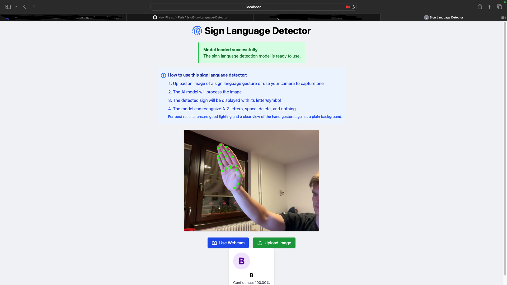

# Sign Language Detector 

A real-time American Sign Language (ASL) detection web app using MediaPipe Hands and a custom-trained TensorFlow.js model.

Built with:
- React + Vite ⚛️⚡
- TypeScript 🛠
- Tailwind CSS 🎨
- TensorFlow.js 🧠
- MediaPipe Hands ✋
- Vercel Deployment (soon)🚀

## 🌐 Live Demo
👉 (soon)

## ✨ Features

- 📸 Real-time hand sign detection using webcam
- 🖼 Upload image-based ASL predictions
- 🎯 Model trained on custom MediaPipe landmark data
- ⚡ Fast inference with TensorFlow.js
- 🎨 Responsive modern UI (Tailwind + Lucide icons)

## 🛠 How It Works

1. MediaPipe Hands detects 21 hand landmarks (x, y, z)
2. Extracted landmarks are fed into a trained neural network
3. The model classifies the gesture as an ASL letter or action (`A-Z`, `space`, `del`, `nothing`)

## 🚀 Deployment

This project is deployed using **Vercel**.  
Every push to `main` automatically redeploys.

To deploy manually:

```bash
# Build
npm run build

# Preview locally
npm run preview
```

📂 Folder Structure

├── src/
│   ├── components/
│   │   └── ImageUpload.tsx  // Main detection logic
│   ├── assets/              // Icons, logo, etc.
│   ├── App.tsx              // Entry UI
├── public/
│   └── model.json           // Exported TensorFlow.js model
├── README.md

🧠 Model Training

Model was trained using custom .npy landmark files for each ASL sign.

Trained and exported with:
	•	TensorFlow 2.15.0
	•	Converted to TensorFlow.js via tensorflowjs_converter

📸 Example




👨‍💻 Author
	•	Faris Alisic
	•	GitHub: @FarisAlisic
